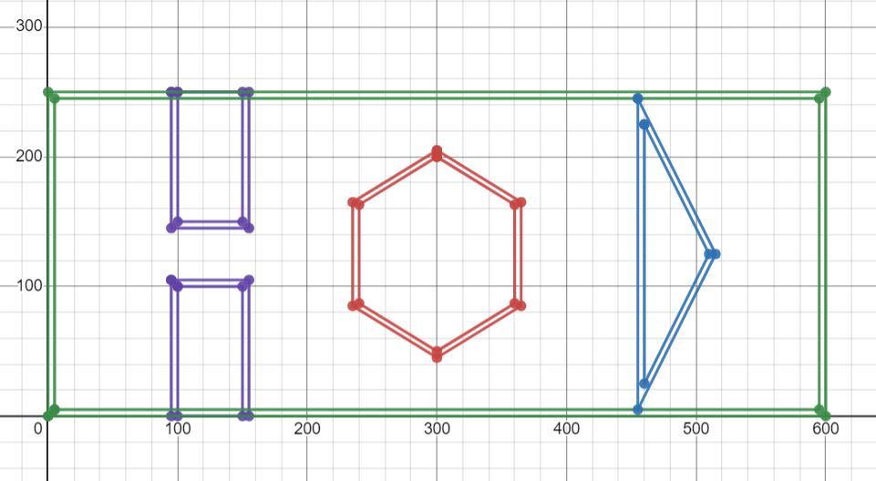

# Implementation-of-Dijkstra-Path-Planning-Algorithm


## Instructions:
- Clone the repository to your local machine using the following command:
    ``` 
    git clone https://github.com/stark-2000/Implementation-of-Dijkstra-Path-Planning-Algorithm.git
    ```
    cd into the cloned repository
    ```
    cd Implementation-of-Dijkstra-Path-Planning-Algorithm
    ```

- Alternatively, you can download the zip file of the repository and extract it to your local machine:
    ```
    cd proj2_dhinesh_rajasekaran
    ```

- Open Terminal and Run the following commands & test with the following test cases: (make sure visulization.py file is in the same folder)
    ```
    python3 dijkstra_Dhinesh_Rajasekaran.py
    ```
- Now for Test Case 1, Enter the following values when prompted or any random values of your choice:
    - Enter the start node as "20,20"
    - Enter the goal node as "425,200"

- Repeat the above step for Test Case 2 with the following values or random values of your choice:
    - Enter the start node as "50,43"
    - Enter the goal node as "250,30"


## Obstacle Space - Map:
   - Adobe Photoshop generated:
   <p align="center">
   
   </p>

   - Desmos Visualization:
   <p align="center">
   
   </p>
    

## Demo Video:
 - Video shows exploration of nodes and finding the goal node for a point robot given start & goal nodes. Once the shortest path is found, it is backtracked and visualized using openCV.
   
https://user-images.githubusercontent.com/78305300/224716580-2c29afed-6261-4706-a8f3-ef806391cdf0.mp4


## Dependencies:
 - visulization.py file (map creation and visualization script)
    - It is already included in the repository in the same folder. Make sure you are running dijkstra_Dhinesh_Rajasekaran.py script from the same folder.

 - Numpy library
    - (if req open terminal and run the following commands)
    ```
    sudo pip install numpy
    ```
- openCV library
    - (if req open terminal and run the following commands)
    ```
    sudo pip install opencv-contrib-python
    ```
- time library
    - (if req open terminal and run the following commands)
    ```
    sudo pip install time
    ```
- heapq library
    - (if req open terminal and run the following commands)
    ```
    sudo pip install heapq
    ```
